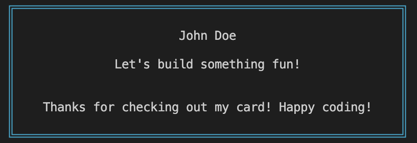

# Let's Build a Go CLI Business Card - Part 1

Seems every developer is trying to find a clever way to get noticed. And in doing so you may stumble on a bunch of interesting projects accomplishing all kinds of things. However, one simple and easy project you can do is making a Business Card for yourself (disguised as a CLI program)! 

To do this we will be writing our CLI program in Go and be leveraging [cobra](https://pkg.go.dev/github.com/spf13/cobra@v1.6.1) which is a great Go library to create this card quickly and effectively. 

To give our program some character we will be leveraging [box-cli-marker](https://github.com/Delta456/box-cli-maker) in this tutorial which is a great project you should check out!

## Before we start why Go? 
[Go](https://go.dev/) is a great language to use for this project because it is a compiled language which means it is fast and easy to work with since the compiler will catch most errors for you. Since it is compiled it is also easy to distribute your program to others.

Also, Go has article on [this](https://go.dev/solutions/clis) but I personally have been working more with Go and have found it a lot of fun to work with. Also the support for CLIs by the community and from the language itself has been really great from what I have found.

But enough about why Go, let's get started!

## Getting started
First let's create a new [Go project](https://go.dev/doc/code) (Go's official documentation is a great place to start). 

Then let's install Cobra and its CLI. [Cobra](https://github.com/spf13/cobra) is a great CLI library for Go and the CLI is a great tool to get started quickly.
```shell
go get -u github.com/spf13/cobra@latest
go install github.com/spf13/cobra-cli@latest
```

Now that we have the Cobra CLI installed let's get some boilerplate set up by running with 1 simple command.

```shell
cobra-cli init businesscard
```
Note that `businesscard` is the name of the cli for this example but you can name it whatever you want (ex: jdvert is what I used for my own card). 

This will generate a `cmd` directory for you with a `root.go` file for you. This is where the bulk of your code will live

To see if everything is working let's install our CLI and run it!

```shell
go install
businesscard
```

You should see the following output (which is the default Cobra output):
```shell
A longer description that spans multiple lines and likely contains
examples and usage of using your application. For example:

Cobra is a CLI library for Go that empowers applications.
This application is a tool to generate the needed files
to quickly create a Cobra application.

```

## The Actual Card 
Once you confirm everything is working we can then get starting on creating our custom card. 

Let's update the command to show a box with text in it instead of the current text it shows. 

First let's install the box-cli-maker library. This is a great library that allows you to create boxes with text in them. 

```shell
go get -u github.com/Delta456/box-cli-maker
```

Now let's update our `root.go` file to use this library by finding `rootCmd` and updating it to the following:

```go
var rootCmd = &cobra.Command{
	Use:   "businesscard",
	Short: "A personal business card CLI",
	Long:  "businesscard is a personal business card because who has time to actually spend printing real ones.",
	Run: func(cmd *cobra.Command, args []string) {
        // This is where we will add our box which can be found looking at https://github.com/Delta456/box-cli-maker#usage 
        // and the examples in the README are a great place to start!
		Box := box.New(box.Config{Px: 4, Py: 1, Type: "Double", Color: "Cyan", ContentAlign: "Center"})
		Box.Print(
			"John Doe",
			"Let's build something fun!\n"+
				"\n\n"+
				"Thanks for checking out my card! Happy coding!",
		)
	},
}
```

Now lets try out our new card by running `go install` and then `businesscard` again.

Now you should see the following when running your command!



You can customize your card as you wish and [box-cli-marker](https://github.com/Delta456/box-cli-maker/blob/master/README.md) has a bunch of examples on how you can do this. Change the color, icons, size, etc. The sky is the limit!

## Conclusion

In this first part of the tutorial we got our Go Business Card CLI program set up and looking great in our terminal. However, this is still a program and not an actual card. So, we need some way to allow the user to interact with it! See how you can do this in part 2 (coming soon). 

Happy coding!


